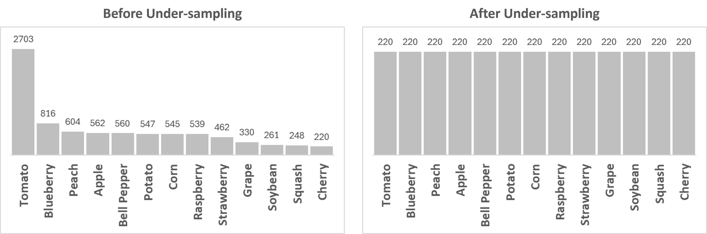

# Plant Disease Detection Using YOLO
This project aims to develop a robust plant disease detection system using advanced machine learning techniques, primarily leveraging YOLO (You Only Look Once) for object detection. The workflow includes data preprocessing, feature extraction, non-negative matrix factorization (NMF), fuzzy clustering, and model training.

## Project Overview
This project focuses on the detection of plant diseases through image analysis. By utilizing machine learning algorithms, we can identify and classify diseases present in various plants based on their visual characteristics.

### Data Review
- Number of records in the training dataset: 2330
- Number of records in the test dataset: 239
- Total records: 2569
- Plant species: 13
- Classes: 30
- The split is 91% training and 9% test.

### Random Images from the Dataset

### Unique Classes

## Data Preparation
The dataset used for this project is PlantDoc, which contains images of healthy and diseased plants. Images are categorized into different classes based on the type of plant and the specific disease.

### Unrepresented Classes
The underrepresented classes, Potato Leaf (11), Soybean Leaf (15), and Tomato Two-Spotted Spider Mite Leaf (2) were removed from the dataset.

### Class Imbalance
To tackle the class imbalance, we plan to under-sample the overrepresented classes were undersampled based on the sample size in the minority class.

## Feature Extraction
We utilize a pretrained VGG16 model to extract features from the images, enhancing the model's ability to recognize patterns related to plant diseases. The extracted features are stored in a structured format for subsequent analysis.

### Process
- Load the VGG16 model with pretrained weights.
- Extract features from each image in the dataset and flatten the resulting arrays for further processing.

## Non-Negative Matrix Factorization (NMF)
NMF is employed to decompose the feature set into parts that represent the hidden patterns within the images, helping in identifying shared features such as shapes and colors.

### Elbow Curve
An optimal number of components is determined through reconstruction errors.

### Observations
Components are analyzed and interpreted to derive meaningful insights into the underlying data.

### Actions
#### Component 0: Plant Disease Focus.
Ensure the dataset is balanced using resampling techniques and addressing unrepresented classes.

#### Component 1: Abstract Focus.
Add color variations by adjusting contrasts, brightness, and hue.

#### Component 2: Strawberry Leaves Focus.
Add more training examples using geometric transformations like flipping, rotating, and cropping.

#### Component 3: Fruit Variety Focus.
Handle class imbalance

## Fuzzy C-Means Clustering

### Elbow Curve
An optimal number of clusters is determined through Fuzzy Partition Coefficients (FPC).

### Observations
Each cluster corresponds to a specific focus area (e.g., plant disease focus, plant morphology).
 

### Actions
#### Cluster 0: Plant Disease Focus.
Ensure the dataset is balanced using resampling techniques and addressing unrepresented classes.

#### Cluster 1: Plant Morphology Focus.
Introduce random noise such as Gaussian noise to simulate real-world image imperfections.

#### Cluster 2: Abstract Focus.
Add color variations to by adjusting contrasts, brightness, and hues.

## Data Augmentation
To improve model robustness, data augmentation techniques are employed. This includes various transformations such as flipping, rotating, cropping, and brightness adjustments to enrich the dataset.

### Procedure:
- Define augmentation sequences to create diverse training examples.
- Apply augmentations while ensuring the integrity of bounding box annotations.

## Modeling
The YOLO model is initialized and trained on the processed dataset.

### Configuration
- Update data.yaml to specify training, validation, and test paths.
- Remove underrepresented classes to enhance model training.

### Training Parameters
- Epochs: 100
- Batch Size: 16

## Results
Upon training, the model is evaluated using key metrics:

### Mean Average Precision (mAP) at IoU thresholds:
- mAP50: 0.471
- mAP50-95: 0.363

## Conclusions
This project demonstrates the effectiveness of leveraging deep learning models for plant disease detection. Through careful data preparation, feature extraction, and model training, we can build a system capable of accurately identifying plant diseases, which can significantly aid agricultural practices.

## License
This project is licensed under the Raza Mehar License. See the LICENSE.md file for details.

## Contact
For any questions or clarifications, please contact Raza Mehar at [raza.mehar@gmail.com], Pujan Thapa at [iampujan@outlook.com] or Syed Najam Mehdi at [najam.electrical.ned@gmail.com].
